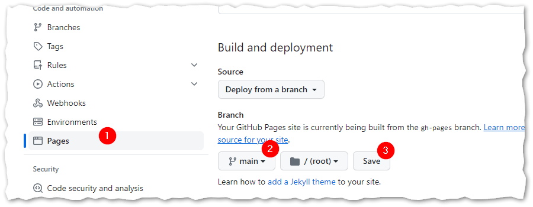
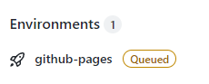
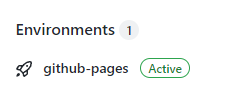

# Floating Assignment: Cheat Sheet (hosted by Github Pages)

This should become the home for your WMC 'Cheat Sheet' - your personal knowledge base about HTML, CSS and other web technologies.
Add all necessary files for your cheat-sheet to this repository. The content will grow over time, we start with a simple ```index.html```
and add further content, such as styles, images, etc. on the way.

The goal is to host the cheat sheet as web page on Github and access it directly from your repository.

To achieve this goal, the following preparations are required:
- Clone your assignment repository (already done, right? ;)
- In Github: Enter **Settings** of your repository, find menu **Pages**
  - Active Github pages by selecting your 'main' branch (called either 'main' or 'master', depending on your set-up).
  - 
- Your web page should be accessible via URL ```https://if-03-01-2bhif-wmc-2223.github.io/<name-of-your-repo>``` after a while
- Check if Github pages are enabled
  - Deployment is on the way: 
  - Deployment can be accessed via URL: 

## Important:
Your repository MUST be public (and is therefore readable by anyone) to make it accessible via Github pages.
